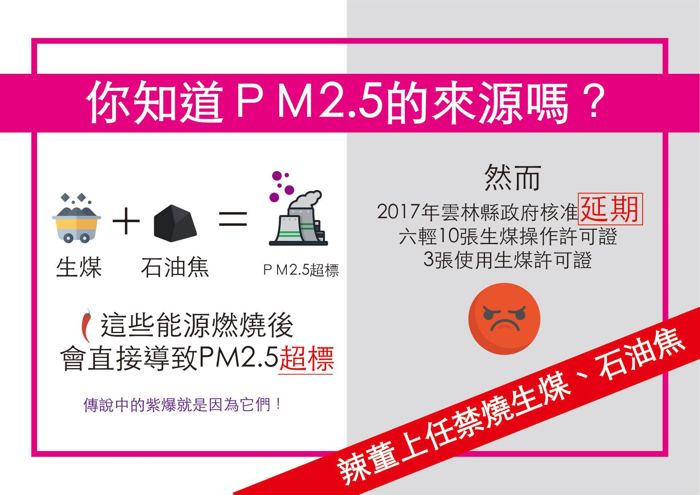
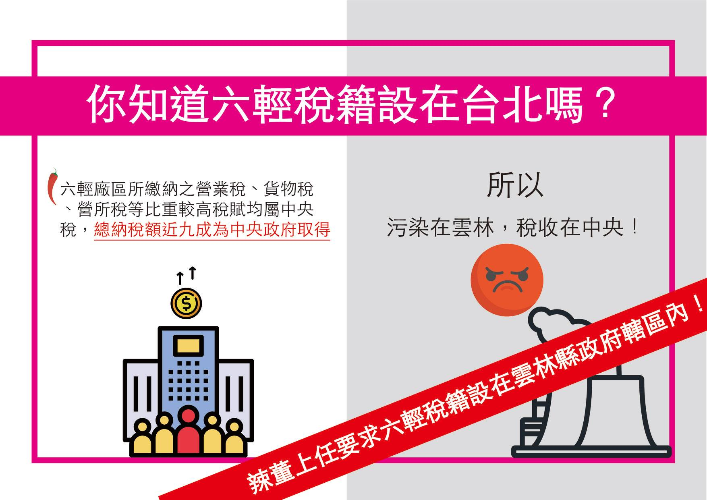
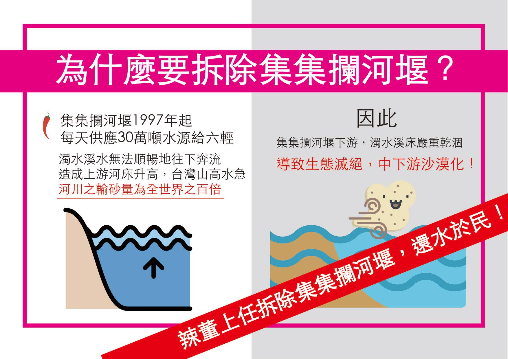

# 1. 環境正義

### 1.1. 禁燒生煤石油焦

### 1.2. 要求六輕總公司設籍在雲林

六輕有九成的稅收在中央，只繳給給雲林地價稅、房屋稅等低廉的稅金，對於雲林經濟財政根本無濟於事，即是將污染流在雲林，完全是債留子孫，因此辣董嚴正提出六輕必須稅籍設在雲林轄區內

### 1.3. 拆除集集攔河堰

杜絕濁水溪揚塵，集集攔河堰直接橫斷河道的後遺症，就是造成濁水溪流域最為嚴重的揚塵問題。將水歸還農業灌溉水系，還水於民，縣民自然不需被迫鑿井取水造成地層下陷

### 1.4. 廣設空氣盒子，全民監督空氣品質

### 1.5. 結合公民組織，成立六輕空汙治理委員會

