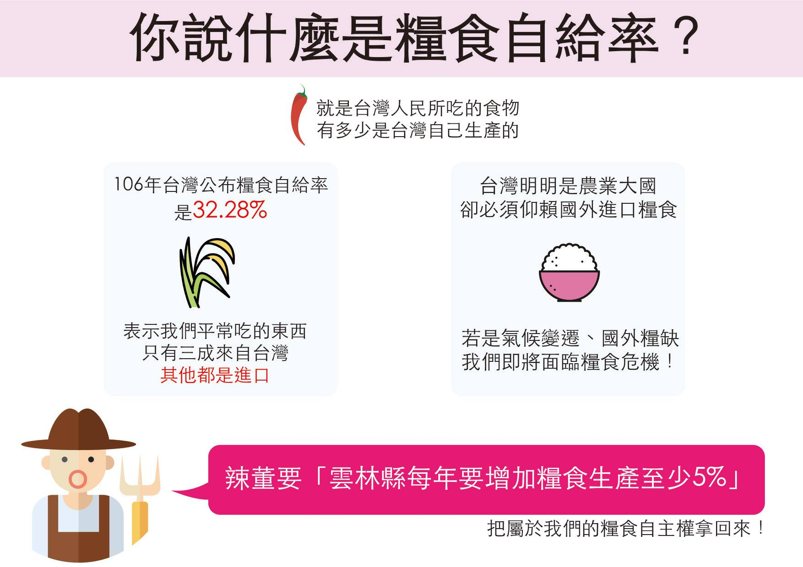
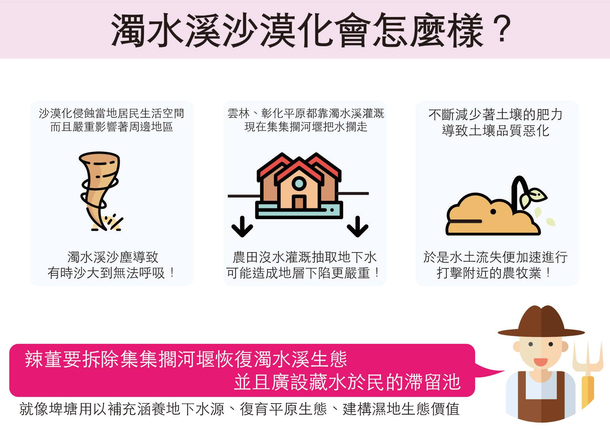
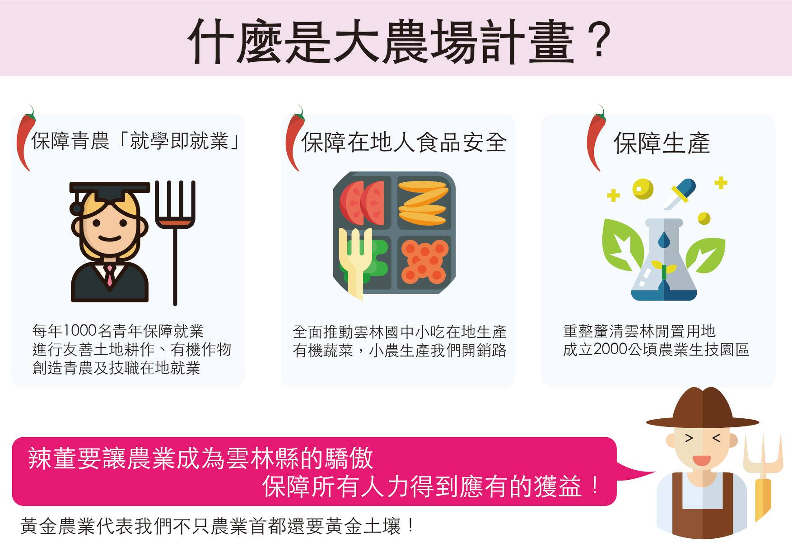

# 4. 黃金農業

### 4.1. 農業是未來的黃金產業，目前台灣糧食自給率僅有30%是重大的國安問題，雲林做為農業大縣，雲林縣每年要增加糧食生產至少5%，體現發展農業經濟的決心，做為台灣糧食安全的後盾

### 4.2. 富饒美麗濁水溪

除了主張拆除集集擱河堰，同時在林內、莿桐、西螺、崙背、二崙、麥寮等地區，設置鄉鎮級的滯洪池。並且廣設藏水於民的滯留池，用以補充涵養地下水源、復育平原生態、建構濕地生態價值

### 4.3. 增設農牧用地

1. 提供青年農業創業從事休閒農業
2. 以滯留池的連續地景，創造與水共存、還水於河、濕地與產業合作之濁水溪生態農業生活空間

### 4.4. 大農場計畫

1. 保障青農「就學即就業」：每年1000名青年保障就業，進行友善土地耕作，創造青農及技職在地就業
2. 保障在地人食品安全：推動雲林國中小吃有機蔬菜
3. 保障生產：成立2000公頃農業生技園區

### 4.5. 打造雲林草藥園區

1. 推廣草藥專業知識
2. 開設藥草學習班
3. 推廣在地有機藥草

