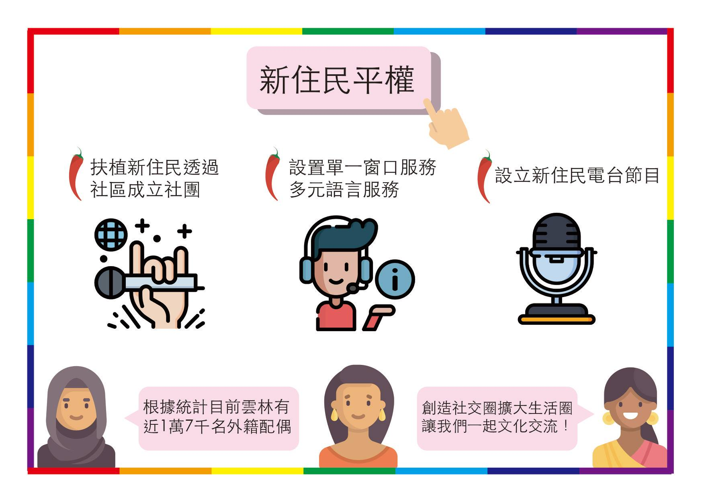
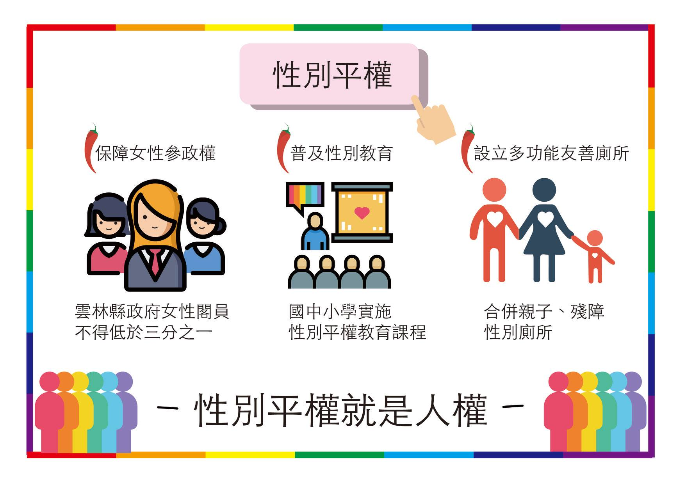
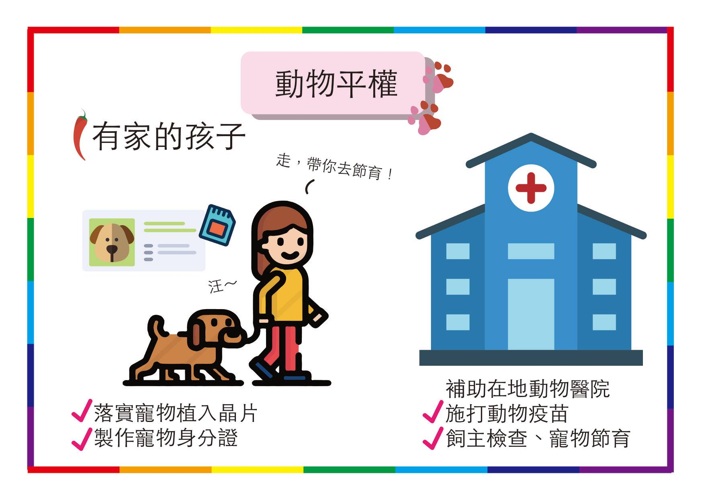
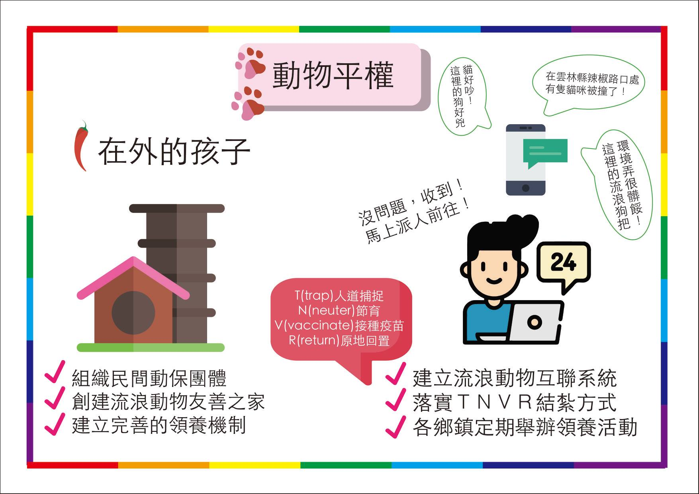
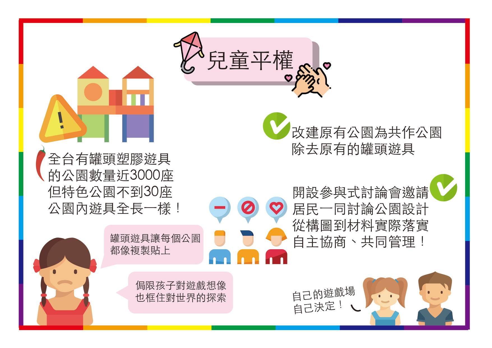

# 7. 世代平權

## 新住民平權

1. 扶植新住民透過社區成立社團，舉辦文化交流等活動。
2. 設置單一窗口服務，多元語言服務。將新住民事務整合獨立服務窗口，新住民可在此辦理各項事務
3. 設立新住民電台節目：新住民可自主決定電台節目，透過電台節目使聽眾更加了解新住民，也讓新住民有一個發聲的平台

## 性別平權

1. 性別平權就是人權，雲林縣政府女性閣員不得低於三分之一
2. 落實國中小學各性別平權教育課程
3. 設立多功能友善廁所，合併成親子、殘障、性別廁所

## 動物平權 

1. 組織民間動物團體，創建動物之家，整理流浪動物環境、落實ＴＮＶＲ結紮方式，定期舉辦領養活
2. 推行寵物植入晶片，製作寵物身分證，補助在地動物醫院、施打動物疫苗、飼主檢查、寵物節育

## 兒童平權

1. 改建原有公園為共作公園，除去原有的罐頭遊具，開設參與式討論會邀請附近居民一同討論公園設計，使居民不再受限於原有規範，從構圖到材料，實際落實自主協商、共同管理

