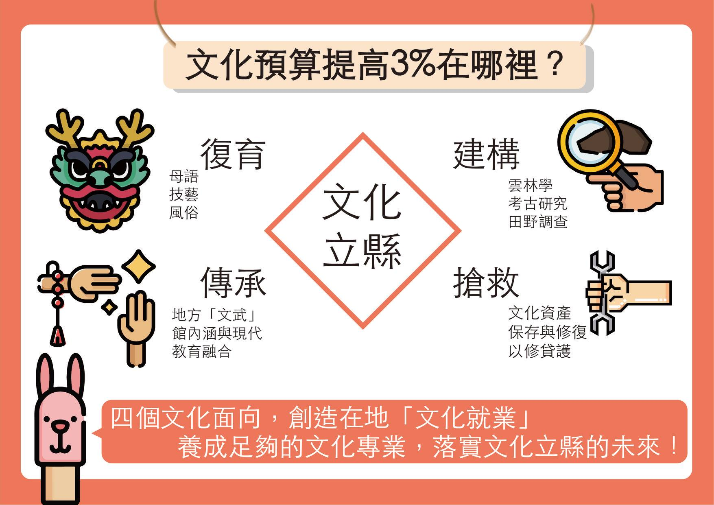
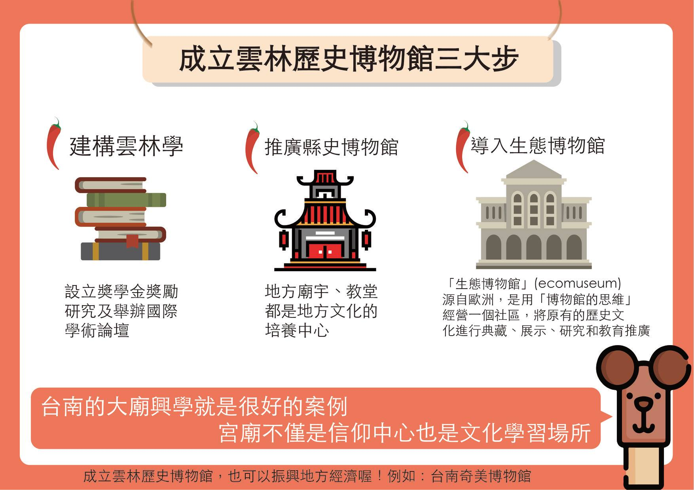
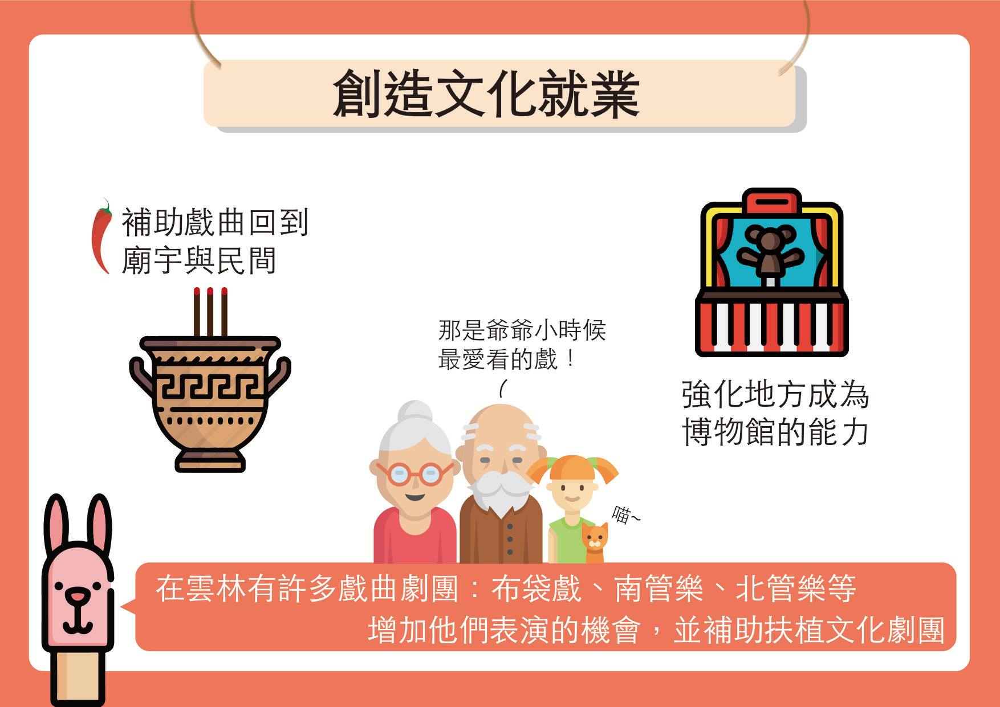

# 3. 文化立縣

### 3.1. 保存文化資產，創造文化就業機會，提高文化預算達年度總預算3%。

為什麼需要提高到3%，「文化」這個詞，當然可以是生活的統稱，任何專業都有自己的文化，比如說文化部說「行政院部部都是文化部」的概念就是如此泛化的指稱，但如果如此我們又何必需要一個文化部呢？  
  
但我們需要特別強調文化經費的提高，是因為台灣本土文化面臨長期的扭曲以及民俗技藝的失傳，文化資產面臨破壞⋯⋯等現實原因，現在不是文化建設概的年代，而是要保存與復育文化的狀態。  
  
因為文化政策經費長期的不足，無法達到重建文化內容與培力文化就業的效益，比如說我們要談雲林做自己，首先要知道什麼是雲林，這就需要建立「雲林學」的研究計畫與人才的養成。像日本統治台灣初期，成立土地調查、舊慣調查、山林調查，當然這是一個以殖民宗主國的立場來看待台灣，同樣的，雲林要做自己，也需要以自己的立場來看待這塊土地，而我們長期以來，都是用透過外來政權的扭曲眼光來看待自己生長的土地，始終缺乏自己的立場和世界觀，所以我們需要的的是文化資產的保存和文化的復育，然後才能有條件談文化就業，進而才談文創產業。  
  
現在的政府普遍將文化視為一種行銷與討好的手段，無法有效建立文化主體內涵，所以全台灣才會到處古蹟自燃，要應付阻止這種情況發生，而要充足的人力與經費，如果談「文化立縣」，但經費和組織仍舊一樣，那就是空話。我們有教育基本法保障教育經費22%，但文化做為一個教育的價值核心，卻沒有文化基本法的預算保障，特別是對數百年來被殖民的台灣來說要談文化主體與轉型正義，是不可思議的。

### 3.2. 成立雲林歷史博物館

雲林學、縣史博物館、生態博物館（廟宇、教堂就是地方文化館，也是美術館、博物館，才是知識中心）。

台南市社區大學台江分校與海尾朝皇宮於2007年起共同推動「大廟興學」運動，結合大廟與知識分子力量，重回村廟，「發展社區」「發展學習」「發展生命」。  
  
執行長吳茂成從鄉土教育守護環境開始，為河川發聲，不僅認識台江村落文化、流域生態的美麗與哀愁，也是共創美好家園的社會實踐行動。進而倡議台灣村廟乃是地方固有的社會參與、社區學習、文化共同體、公共財、鄉村的自治機關，於是展開台江大廟興學運動，提出大廟是村莊的信仰中心，也是學習中心，社會參與中心，公共生活中心的理念，創辦社大台江分校。  
  
大廟興學回到先民讀書的學堂、議事的公茨、祭祀的村廟，以祭祀圈為學習圈，倡議一村一廟一學堂，一村一廟一樂團，一村一廟一書房，邀請知識分子、非營利組織、環境藝文工作者，重回村廟，以大廟社區為教室，策辦在地學習課程，社會參與活動，鼓勵老中青三代，重回村廟，踏查台江民俗文化，營造社區博物館，探究公民美學、公共建築的文化治理可能。

### 3.3. 創造文化就業

補助戲曲（布袋戲、南管、北管等）回到廟宇與民間、強化上述地方成為博物館的能力（研究、典藏、推廣、教育）。

### 3.4. 發展傳統戲曲及布袋戲重點實驗學校，成立雲林縣實驗教育協作中心

### 3.5. 每一鄉鎮都有一間「公民文化沙龍」

「虎尾厝沙龍」就是一間文化、社會、女性、為主的書店，而沙龍也是意味著「由一個主人邀請其他客人參加，增加他們彼此交流的機會，或者得以愉悅自身及提升修養的聚會」。

### 3.6. 建構VR實境雲林古蹟小鎮

雲林目前還保留著與多歷史建物，在西螺、虎尾都還能稱得上是「日式古蹟小鎮」，因次辣董將把過往，以虛擬實境的概念呈現，讓舊雨新知都能重回以往雲林街上的樣態。

### 3.7. 奬勵雲林學研究及文化人才就業，以生態博物館概念，利用公有閒置文化資產空間成立雲林縣歷史博物館，雲林縣擁有台灣三大國家重要民俗，不論史前與近代史的開拓均有獨特的歷史，落實雲林要做自己

### 3.8. 建構雲林學，設立雲林學獎學金，獎勵雲林學研究及舉辦雲林學國際學術論壇

