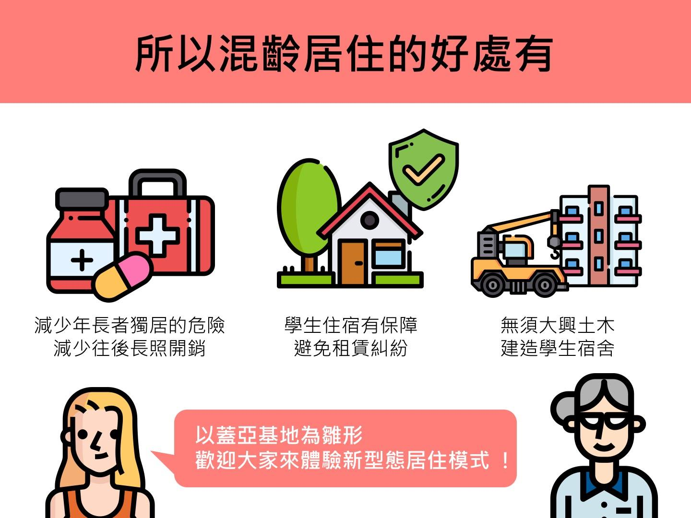

# 6. 青年平台

### 6.1. 小六青計畫

1. 創建六青訓練基地，閒置公有空間成立「六青訓練基地」並作為台灣聚落訓練返鄉青年的職訓中心，提供300名就業機會，每人保障薪資。以修代護、創業培力，就業三年後，提供青年創業無息貸款。
2. 青年郡役所：co-working，青年回流諮詢協力平台（青年就業輔導、青年創業媒合、青年安置服務、經營實務培力）。
3. kobi製糖所：創意市集、青年商店。

### 6.2. 生態跳村，青銀共居

**媒合大學生奇寓計畫：虎科、雲科、環球科大、中國醫藥大學北港分部**

雲林縣人口外流嚴重，老化人口高居台灣第二，其中獨居老人人口高達2500名;同時雲林縣內有四所大專院校，約有一半的學生無學校宿舍可住。辣董認為高齡者與學生的居住問題不容忽視，因此提出一項解決居住問題的政策。

辣董希望以「蓋亞基地」為雛形，幫助青年與高齡者兩個有居住需求的族群，媒合兩者發展共同居住住宅，同時可以修繕老屋、闢建庭園綠地形成小型生態跳島，使蝴蝶、青蛙等生物於城鎮中有棲生之處與移動空間。

蓋亞基地為王麗萍以減碳減廢與就地取材的方式修復的埒內王家老三合院，其注重環境永續與生態復育，為虎尾厝沙龍的第二基地，辣董期望往後可成為「青銀共居，生態跳村」的示範基地。

### 6.3. 青農育成

1. 創造青農及技職在地就業，每年結合北港高工、西螺高工、虎尾農工建教合作，提供保送至農業科系大學的名額（如台灣大學、屏東科技大學、嘉義大學、中興大學等）以及每年國外技職留學名額（如德國、日本）歸國後、畢業後將提供1000名保障薪水就業機會。

### 6.4. 托育政策

兒童是國家未來的主人翁，保護每個孩子健康安全長大，即是保障國家的繁榮前景，為保障雲林縣民托育與親子需求，在辣董的青年平台政見中，包含兩項對於雲林托育及親子的政策

1. 各鄉鎮設立公托非營利幼稚園，往下延伸設置二年幼稚教育。
2. 定點臨托服務：集中型（青年就業）與散村型各鄉鎮成立兒童館，教育與學習、保母教育中心。

### 6.5. 親子友善空間/母嬰散策道

1. 原防火巷建構成為推嬰兒車、殘障者輪椅、遊客散步道、獎勵綠後院綠前院。

